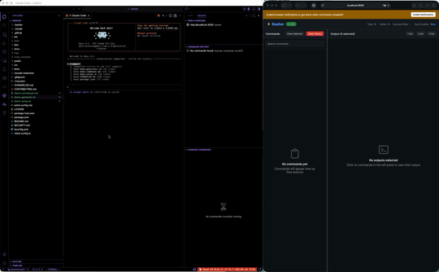

# Basher

MCP server for executing shell commands with enhanced logging, history tracking, and improved visibility over standard bash execution.

<p align="center">
  
</p>

## Features

- **Enhanced Command Execution**: Execute shell commands with real-time output streaming
- **Process Management**: Track, monitor, and terminate running commands
- **Token-Efficient Querying**: 90-95% token savings with tiered output levels
- **Smart Search**: Full-text search across commands, stdout, and stderr
- **Aggregations & Analytics**: Group and analyze commands by type, directory, or time
- **Web UI Dashboard**: Real-time dashboard with SSE updates
- **VS Code Extension**: Native sidebar panel with live output streaming
- **Command Templates**: Save and reuse command configurations
- **Command Sessions**: Group related commands for better organization
- **Command Whitelisting**: Security defense-in-depth requiring explicit approval
- **Basher Light Mode**: Minimal 5-tool version for ~80% fewer tokens

## Platform Support

| Platform | Status | Notes |
|----------|--------|-------|
| **macOS** | ✅ Fully supported | Primary development platform |
| **Linux** | ✅ Fully supported | Tested on Ubuntu |
| **Windows** | ⚠️ Experimental | Commands execute via `cmd.exe` with Unix-specific defaults |

## Quick Install

```bash
claude mcp add --transport stdio basher --env WEB_PORT=3000 -- npx -y github:Bazilikum/basher --project "$(pwd)"
```

**Verify installation:**
```bash
claude mcp list
```

## Documentation

| Topic | Description |
|-------|-------------|
| [Installation](docs/installation.md) | Quick install, Basher Light, manual setup, team configuration |
| [Quick Start](docs/quick-start.md) | Basic usage, Web UI, VS Code extension |
| [MCP Clients](docs/mcp-clients.md) | Claude Code, Cline, Cursor, Windsurf, Claude Desktop |
| [Tools Reference](docs/tools-reference.md) | Complete documentation of all 27 MCP tools |
| [Web UI](docs/web-ui.md) | Dashboard features and REST API |
| [VS Code Extension](docs/vscode-extension.md) | Extension features and configuration |
| [Token Efficiency](docs/token-efficiency.md) | Tiered output levels, Toon format, best practices |
| [Whitelisting](docs/whitelisting.md) | Command security and approval workflow |
| [Development](docs/development.md) | Build, test, and contribute |
| [API](docs/api.md) | Complete API reference |
| [Architecture](docs/architecture.md) | System design and components |

## Quick Example

```typescript
// Execute a command
execute_command({ command: "npm test" })

// Get recent commands
get_recent_commands({ limit: 10 })

// Search for errors
search_command_history({ query: "error" })

// View statistics
get_command_stats()
```

## Improvements Over Standard Bash

| Feature | Standard Bash | Basher |
|---------|---------------|-------------------|
| Command Execution | ✅ | ✅ |
| Real-time Output | ✅ | ✅ |
| Process Management | Basic | ✅ (Track & Terminate) |
| Structured Logging | ❌ | ✅ |
| Persistent History | ❌ | ✅ (SQLite) |
| Full-Text Search | ❌ | ✅ (FTS5) |
| Advanced Filtering | ❌ | ✅ (Multi-criteria) |
| Statistics & Analytics | ❌ | ✅ |
| Token Efficiency | ❌ | ✅ (90-95% savings) |
| Web UI Dashboard | ❌ | ✅ (Real-time SSE) |

## License

MIT

## Author

Bazilikum

## Contributing

Issues and pull requests are welcome at https://github.com/Bazilikum/basher
